```{r}
#| label: setup

library(tidyverse)
library(gt)
library(kableExtra)
library(readxl)
library(wesanderson) # colours
library(gghalves)
library(broom)
library(broom.mixed)
library(ggpubr)
```

```{r}
#| label: functions


## load plot theme
source("impressive_science/functions/plot_theme.R") 

## load other functions
source("impressive_science/functions/functions.R")
```

## {.big-center}

On many important matters, we need to trust science...

---

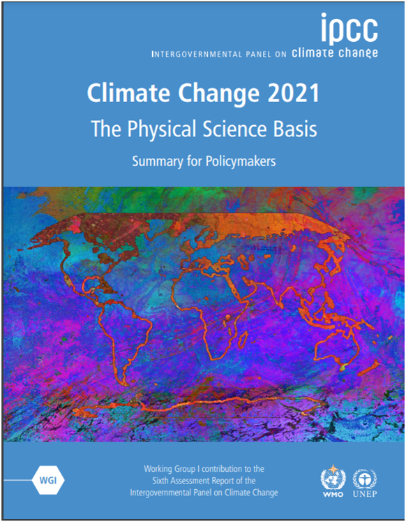{.absolute top="10%" left="10%" width="30%"}

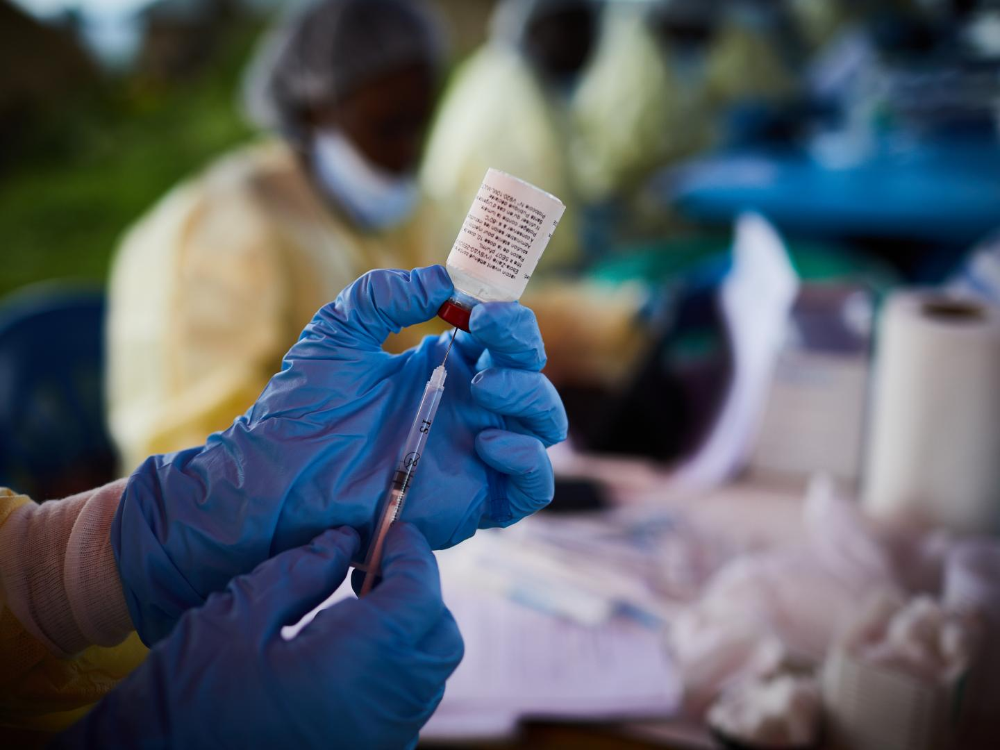{.absolute top="50" right="10%"width="50%"}

---

## {.big-center}
Researchers are typically interested in why people do *NOT* trust science


---

## A lack of trust in science is due to...

. . .

- a **knowledge deficit** <span style="font-size: 50%;">[@sturgisScienceSocietyReEvaluating2004]</span> 

. . . 

- certain **psychological traits**, such as Social Dominance Orientation, conspiratory thinking, hierarchical worldviews <span style="font-size: 50%;">[@hornseyAttitudeRootsJiu2017;@rutjensConspiracyBeliefsScience2022]</span>

. . .

- **motivated reasoning**, i.e. selecting and interpreting information to match one’s existing beliefs or behaviors <span style="font-size: 50%;">[@lewandowskyMotivatedRejectionScience2016; @lewandowskyWorldviewmotivatedRejectionScience2021]</span>

. . .

- **misinformation** <span style="font-size: 50%;">[@nationalacademiesofsciencesUnderstandingAddressingMisinformation2024; @scheufeleScienceAudiencesMisinformation2019; @druckmanThreatsSciencePoliticization2022]</span>

. . .

- people feeling **alienated** from modern and increasingly complex institutions <span style="font-size: 50%;">[@gauchatCulturalAuthorityScience2011]</span> 

---

## {.big-center}

But:

. . .

Across the globe, most people *do* tend to trust science. 


---

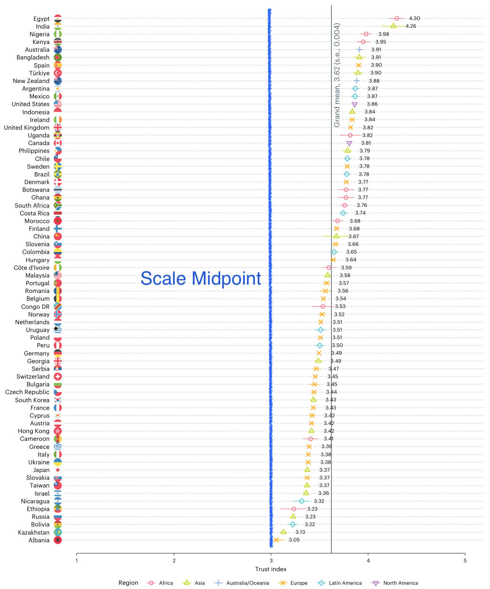{fig-align="center"}

::: {.absolute left="27%" bottom="3%" style="font-size:1.5em; color:black; z-index:9999;"}
Low (1)
:::

::: {.absolute right="23%" bottom="3%" style="font-size:1.5em; color:black; z-index:9999;"}
High (5)
:::

::: {.absolute right="0" bottom="0" style="font-size:1em; z-index:9999;"}
@colognaTrustScientistsTheir2025
:::

---

## The puzzle of trust in science

::: {.big-center}

::: {.fragment}
If trust in science is rational, its main driver should be knowledge and understanding of science (cf. deficit model)
:::

::: {.fragment}
But...
:::

:::

---

::::: {.columns style='display: flex !important; height: 90%;'}

::: {.column width="20%" style='display: flex; justify-content: center; align-items: center;'}

:::{.big-center}
People don't know much about science
:::

:::

::: {.column .center-right width="80%"}

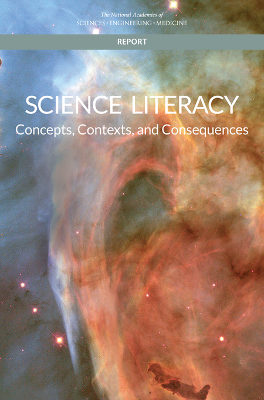
:::

::::

---

## {visibility="hidden"}

::: {.big-center}

For example, in 2020, "60% of U.S. adults could correctly note that a control group can be useful in making sense of study results" <span style="font-size: 50%;">[@nationalscienceboardnationalsciencefoundationScienceTechnologyPublic2024, p.24]</span> 

:::

--- 

:::: {.big-center}

Science knowledge is only weakly correlated with attitudes towards science in general <span style="font-size: 50%;">[@allumScienceKnowledgeAttitudes2008]</span>   

::: {.fragment}
National average PISA scores are not correlated with national average trust in scientists <span style="font-size: 50%;">[@colognaTrustScientistsTheir2025]</span>  
:::

::::

---

:::: {.big-center}

Is public trust in science irrational?

::: {.fragment .fade-in-then-out fragment-index=2 style="font-size:30px;"}
*If yes, we would expect, e.g., people to be highly susceptible to misinformation*
:::

::: {.fragment fragment-index=3}
If not because of knowledge and understanding, why do people trust science?
:::

::: {.fragment .fade-in-then-out fragment-index=4 style="font-size:30px;"}
*If we can answer this, this will likely also help us understand how to foster public trust in science* 
:::

::::


# The rational impression account of trust in science

---

::: {.big-center}
A cognitive model of how people come to trust science
:::

---

## Two basic cognitive mechanisms

::: {.fragment fragment-index=1 style="font-size:1.5em;"}
1. People infer competence from possessing rare knowledge. [But while the impression of competence persists, people forget the specific knowledge]{.fragment fragment-index="2"} [Chapter 3]
:::

::: {.fragment fragment-index=3 .fade-in-then-out style="font-size:30px;"}
*For example, if a colleague at work fixes our computer, we might remember that she is competent, but not exactly how she fixed it.*
:::

::: {.fragment fragment-index=4 style="font-size:1.5em;"}
2. People infer accuracy from consensus [Chapter 4]
:::

::: {.fragment fragment-index=5 .fade-in-then-out style="font-size:30px;"}
*For example, if we have to pick between two restaurants we don't know, but everyone we ask says that Restaurant A is better, we'll believe it is indeed better*
:::


# [Chapter 3] <br> <br> Trusting but forgetting impressive science 

::: {.absolute right="-100" bottom="-100" style="font-size:1em; z-index:9999; width:300px; white-space:normal;"}
[@pfanderTrustingForgettingImpressive2025]
:::

::: {.absolute top="-100" right="10%" .fragment .fade-in-then-out fragment-index=1}
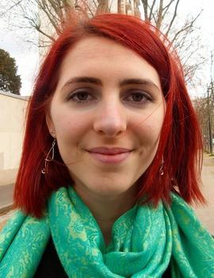{height="150px"}
:::

::: {.absolute top="-100" right="-10%" .fragment .fade-in-then-out fragment-index=1}
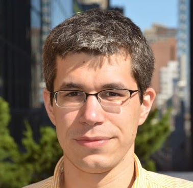{height="150px"}
:::

---

::: {.big-center}
Two Studies

696 participants from the UK 
:::

---

## {visibility="hidden"}

::::: {.columns style='display: flex !important; height: 90%;'}

::: {.column .center-right width="50%" style="font-size:20px;"}

[Entomologists are scientists who investigate insects, typically having a background in biology. They study, for example, how a swarm of bees organizes, or how ants communicate with each other.]{.fragment .fade-out fragment-index="1"} They also study how different insects interact with each other and their environment, whether some species are in danger of going extinct, or whether others are invasive species that need to be controlled. [Sometimes entomologists study insects by observing them in the wild, sometimes they conduct controlled experiments in laboratories, to see for example how different environmental factors change the behavior of insects, or to track exactly the same insects over a longer period of time. An entomologist often specializes in one type of insect in order to study it in depth. For example, an entomologist who specializes in ants is called a myrmecologist.]{.fragment .fade-out fragment-index="1"}

:::

::: {.column .center-right width="50%" style="font-size:20px;"}

[Entomologists are the scientists who study insects. Some of them have specialized in understanding how insects perceive the world around them, and they have uncovered remarkable abilities. Entomologists interested in how flies’ visual perception works have used special displays to present images for much less than the blink of an eye, electrodes to record how individual cells in the flies’ brain react, and ultra-precise electron microscopy to examine their eyes. Thanks to these techniques, they have shown that some flies can perceive images that are displayed for just three milliseconds (a thousandth of a second) – about ten times shorter than a single movie frame (of which there are 24 per second).]{.fragment .fade-out fragment-index="1"} Entomologists who study the hair of crickets have shown that these microscopic hairs, which can be found on antenna-like organs attached to the crickets’ rear, are maybe the most sensitive organs in the animal kingdom. The researchers used extremely precise techniques to measure how the hair reacts to stimuli, [[...]]{.fragment .fade-in fragment-index="1"} [such as laser-Doppler velocimetry, a technique capable of detecting the most minute of movements. They  were able to show that the hair could react to changes in the motion of the air that had less energy than one particle of light, a single photon.]{.fragment .fade-out fragment-index="1"}

:::

::::

---

## Study 1

::::: {.columns style='display: flex !important; height: 90%;'}

::: {.column .center-right width="50%" style="font-size:20px;"}

Version A

[(less impressive)]{.fragment fragment-index="2"}

[Archaeology is the science that studies human history and prehistory based on the analysis of objects from the past such as human bones, engravings, constructions, and various objects, from nails to bits of pots. This task requires a great deal of carefulness, because objects from the past need to often be dug out from the ground and patiently cleaned, without destroying them in the process. <br> Archaeologists have been able to shed light on human history in all continents, from ancient Egypt to the Incas in Peru or the Khmers in Cambodia. <br> Archaeologists study the paintings made by our ancestors, such as those that can be found in Lascaux, a set of caves found in the south of France that have been decorated by people at least 30000 years ago.]{.fragment .fade-out fragment-index="1"} <br> Archaeologists have also found remains of our more distant ancestors, showing that our species is just one among several that appeared, and then either changed or went extinct, such as Neanderthals, Homo erectus, or Homo habilis.

:::

::: {.column .center-right width="50%" style="font-size:20px;"}

Version B

[(more impressive)]{.fragment fragment-index="2"}

[Archaeologists, scientists who study human history and prehistory, are able to tell, from their bones, whether someone was male or female, how old they were, and whether they suffered from a range of diseases. Archaeologists can now tell at what age someone, dead for tens of thousands of years, stopped drinking their mother’s milk, from the composition of their teeth. <br> Archaeologists learn about the language that our ancestors or cousins might have had. For instance, the nerve that is used to control breathing is larger in humans than in apes, plausibly because we need more fine-grained control of our breathing in order to speak. <br> As a result, the canal containing that nerve is larger in humans than in apes – and it is also enlarged in Neanderthals.]{.fragment .fade-out fragment-index="1"} <br> Archaeologists can also tell, from an analysis of the tools they made, that most Neanderthals were right-handed. It’s thought that handedness is related to the evolution of language, another piece of evidence suggesting that Neanderthals likely possessed a form of language.

:::

::::

--- 

## {.big-center}


Participants perceived some science related information as more impressive than other

. . .

Participants who read the more impressive texts reported larger increases in trust in the discipline (e.g Archaeology) and and perceptions of scientists (e.g. Archaeologists) as competent 

---

## Study 2

::: {.big-center}
Participants read the impressive version of the texts from Study 1.

::: {.fragment}
Again, participants reported increased trust.
:::

:::

---

::: {.big-center}
Then, right after, we asked participants to recall what they had read (open-ended question)

::: {.fragment}
Result: not much
:::
:::

---

::: {.columns style='display: flex !important; height: 100%;'}

::: {.column width="40%"}

```{r knowledge-evaluation-grid, echo=FALSE}
#| label: tbl-knowledge-evaluation-grid
#| tbl-cap: "Recall evaluation grid"

## Create the data frame with consistent row numbers
new_table <- data.frame(
  Archaeology = linebreak(c(
  "1. Archaeologists can determine whether someone was male or female from their bones.",
  "2. Archaeologists can determine how old someone was from their bones.",
  "3. Archaeologists can determine whether someone suffered from a range of diseases from their bones.",
  "4. Archaeologists can determine at what age someone stopped drinking their mother’s milk, based on the composition of their teeth.",
  "5. The nerve controlling breathing is larger in humans than in apes. The canal containing that nerve is also larger in humans and Neanderthals than in apes.",
  "6. The fact that the nerve controlling breathing is larger in humans is possibly due to the need for fine-grained control of breathing to speak.",
  "7. Archaeologists determined that most Neanderthals were right-handed, based on analysis of Neanderthals’ tools.",
  "8. Handedness is thought to be related to the evolution of language. This suggests that Neanderthals likely possessed a form of language."
))
) 

table_output <- new_table %>%
    gt() %>%
    cols_label(
      Archaeology = "Archaeology"
    ) %>%
    tab_source_note(md("For each knowledge element, participants could score a maximum of two points."))

table_output
```

:::

::: {.column width="70%" style='display: flex; justify-content: center; align-items: center;'}

::: {.fragment}
```{r overview-plot, fig.cap="(ref:overview-plot)"}
#| label: fig-overview-plot
#| fig-cap: "The distribution of knowledge scores."
#| fig-height: 7

exp2 <- read_xlsx("impressive_science/experiment_4/data/experiment_cleaned.xlsx")


## make a recall plot

## Define colors
fox_palette <- wes_palette("FantasticFox1")

recall_plot <- exp2 |> 
  ggplot(aes(x = 0, y = knowledge_score)) +  
  ## Half-boxplot
  geom_half_boxplot(side = "l", width = 0.1, outlier.shape = NA, 
                    alpha = 0.7, fill = fox_palette[2], color = fox_palette[2]) +  
  ## Jittered points
  geom_half_point(side = "l", transformation = position_jitter(width = 0.05, height = 0), 
                  alpha = 0.7, color = fox_palette[2]) +  
  ## Small dotted tick mark at maximum knowledge score
  geom_segment(aes(x = -0.5, xend = 0.1, y = 1, yend = 1), 
               color = fox_palette[5], linewidth = 0.6, linetype = "dotted") +  
  ## Label for maximum knowledge score
  annotate("text", x = -0.5, y = 1.02, label = "Perfect recall", 
           hjust = 0, vjust = 0, color = fox_palette[5], size = 3.5) + 
  labs(y = "Recall Score", x = NULL) +
  scale_y_continuous(labels = scales::percent, limits = c(0, 1.05)) +  
  plot_theme +
  theme(axis.text.x = element_blank(),   ## Removes x-axis text labels
        axis.ticks.x = element_blank(),  ## Removes x-axis ticks
        axis.title.x = element_blank())  ## Removes x-axis title


recall_plot
```
:::
:::

:::

::: {.notes}
We built a grading grid and used ChatGPT (cross-validated with human evaluations) to assign scores. 

mean = 32%, median= 29%
:::

---

## {.big-center}

When people read impressive scientific information, their trust in science increases

. . .

They then immediately forget much of the content. 

::: {.notes}
Not just any content, but content that likely was important in generating the impression.

Maybe the knowledge that participants forget is not relevant for the impression. 

Two arguments against this: 

1. We also asked participants after the task to pick impressive information bits. Even among the subset of impressive bits (specific to each participant), they still forgot content 

2. In a validation study, we gave the recalled text to another set of participants. They rated them as less impressive than the original text. 

(if participants had retained all impressive information, and only strip down all the unimportant stuff, we would have predicted no difference). 
:::

---

## Why is this interesting? 

::: {.big-center}

::: {.fragment}
There's nothing new on the psychological mechanisms here (lasting impressions, forgetting of details)
:::

::: {.fragment}
But it's the first attempt to apply them to the case of science
:::

:::


# [Chapter 4] <br> <br> How wise is the crowd: <br> Can we infer people are accurate and competent merely because they agree with each other?

::: {.absolute right="-3%" bottom="-3%" style="font-size:1em; z-index:9999; width:300px; white-space:normal;"}
[@pfanderHowWiseCrowd2025]
:::

::: {.absolute top="-3%" right="10%" .fragment .fade-in-then-out fragment-index=1}
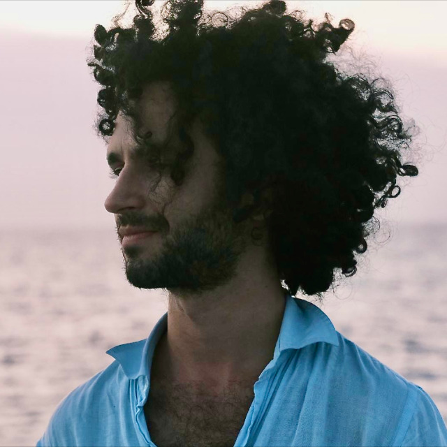{height="150px"}
:::

::: {.absolute top="-3%" right="-10%" .fragment .fade-in-then-out fragment-index=1}
{height="150px"}
:::

---

::::: {.columns style='display: flex !important; height: 90%;'}

::: {.column width="40%" style='display: flex; justify-content: center; align-items: center; font-size:1.5em;'}

Imagine that you live in ancient Greece, and a fellow called Eratostenes claims the circumference of the earth is 252000 stades (approximately 40000 kilometers).

:::

::: {.column .center-right width="60%" style='display: flex; justify-content: center; align-items: center; font-size:1em;'}

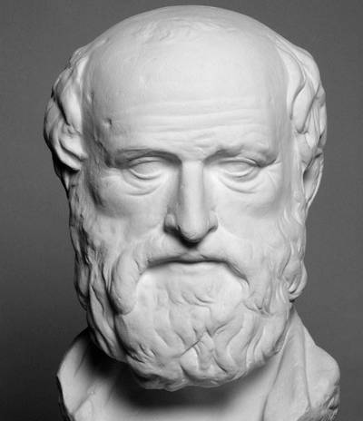
:::

::::

---

::::: {.columns style='display: flex !important; height: 90%;'}

::: {.column width="40%" style='display: flex; justify-content: center; align-items: center; font-size:1.5em;'}

You know nothing about this man, the circumference of the Earth, or how one could measure such a thing. As a result, might (mis)take Eratostenes for a pretentious loon.

:::

::: {.column .center-right width="60%" style='display: flex; justify-content: center; align-items: center; font-size:1em;'}


:::

::::

---

::::: {.columns style='display: flex !important; height: 90%;'}

::: {.column width="40%" style='display: flex; flex-direction: column; justify-content: center; align-items: center; font-size:1.5em;'}

But what if other scholars had arrived at very similar measurements, independently of Eratosthenes? 

::: {.fragment}
Or even if they had carefully checked his measurement, with a critical eye? 
:::

:::

::: {.column .center-right width="60%" style='display: flex; justify-content: center; align-items: center; font-size:1em;'}


:::

::::

::: {.notes}
Wouldn't that give you enough ground to believe not only that the estimates might be correct, but also that Eratosthenes and his fellow scholars must be quite bright, to be able to achieve such a feat as measuring the Earth?
:::

---

::: {.big-center}
6 Experiments

1197 participants from the UK 
:::

---

## {.big-center}

Participants were shown the results of several fictional scenarios, where individuals had made estimates (e.g. players in a game). 

. . .

Participants did not have any information on what the game was about or who the players were.

---

## {.big-center}

Convergent

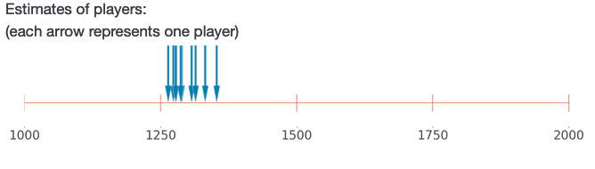

. . .

Divergent

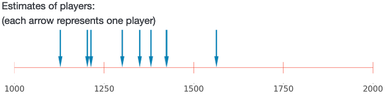

---

## {.big-center}

Participants rated more convergent groups as more likely to be accurate and to be competent.

. . .

In simulations, we showed that this is rational under a wide range of assumptions. 

. . .

(most importantly, that informants are not systematically biased)

---

## Why is this interesting? 

::: {.big-center}

::: {.fragment}
The literature on wisdom of crowds has shown that it is justified to infer accuracy from consensus...[*assuming minimal competence of the informants*.]{.fragment} 
:::

::: {.fragment}
We showed that this competence assumption is not needed. In fact, it is justified to infer competence, too.
:::

:::

# Predictions of the rational impression account 

---

## {.big-center}

[Chapter 5] People should trust science more if they perceive it as more consensual and precise.

. . .

[Chapter 6] People who have been exposed to science in school should trust most of science. 


# [Chapter 5] <br> <br> The French trust more the sciences they perceive as precise and consensual

::: {.absolute right="-100" bottom="-100" style="font-size:1em; z-index:9999; width:300px; white-space:normal;"}
[@pfanderFrenchTrustMore2025]
:::

::: {.absolute top="-100" right="-10%" .fragment .fade-in-then-out fragment-index=1}
{height="150px"}
:::

---

::: {.big-center}
A survey

1012 participants (representative sample) from France
:::

---

## {.big-center}

We asked how consensual and precise participants perceive science in general, and different scientific disciplines in particular. 

. . .

We also asked them about their trust. 

---

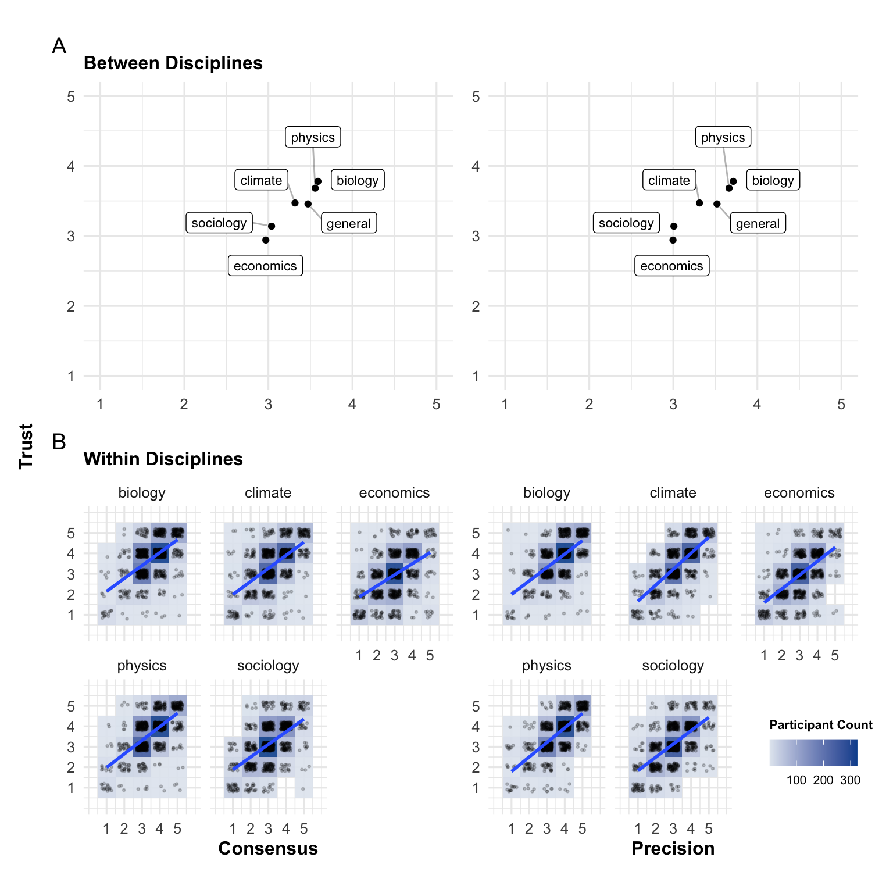{fig-align="center"}

# [Chapter 6] <br> <br> Quasi-universal acceptance of basic science in the US

::: {.absolute right="-100" bottom="-100" style="font-size:1em; z-index:9999; width:300px; white-space:normal;"}
[@pfanderQuasiuniversalAcceptanceBasic2025]
:::

::: {.absolute top="-100" right="10%" .fragment .fade-in-then-out fragment-index=1}
{height="150px"}
:::

::: {.absolute top="-100" right="-10%" .fragment .fade-in-then-out fragment-index=1}
{height="150px"}
:::

---

::: {.big-center}
4 Studies

782 participants from the United States
:::

--- 

## {.big-center}

Even if most people tend to trust science, substantial minorities say that they don't <span style="font-size: 50%;">[@wellcomeglobalmonitorWellcomeGlobalMonitor2018]</span>,

. . .

or believe in conspiracy theories which reject the scientific consensus.

. . .

E.g., in 2023, 24% of Americans agreed that “climate change is a hoax and scientists touting its existence are lying” <span style="font-size: 50%;">[@stockemerUnderstandingClimateChange2024]</span>

---

## {.big-center}

To which extent do these people reject science?

. . .

According to the rational impression account, people who have been exposed to science (mostly via education) should have a solid of baseline of trust in science. 

---

## {.big-center}

We asked participants basic science questions

*E.g., “Are electrons smaller, larger, or the same size as atoms?”*

. . .

We then showed them the scientifically consensual answer, and in some studies also a short explanation, and links to sources. 

. . .

Then we asked: “Do you accept this answer?”

---

```{r}
# read data
exp1_long <- read_csv("everyone_trusts_science_abit/exp_1/data/cleaned_long.csv")
exp2_long <- read_csv("everyone_trusts_science_abit/exp_2/data/cleaned_long.csv")
exp3_long <- read_csv("everyone_trusts_science_abit/exp_3/data/cleaned_long.csv")
exp4_long <- read_csv("everyone_trusts_science_abit/exp_4/data/cleaned_long.csv")

## combine data of all three studies
combined_data <- bind_rows(exp1_long %>% 
                             mutate(study = "1"), 
                           exp2_long %>% 
                             mutate(study = "2"), 
                           exp3_long %>% 
                             mutate(study = "3"),
                           exp4_long %>% 
                             mutate(study = "4")
                           ) %>% 
  ## make a unique id variable
  mutate(id = paste0("study", study, "_", id))
```


```{r}
# make plot data for acceptance
plot_data_acceptance <- combined_data |> 
  drop_na(wgm_sciencegeneral, acceptance) |> 
  # make a labels version of trust in science
  mutate(wgm_sciencegeneral = case_when(
    wgm_sciencegeneral == 1 ~ "1 (Not at all)",
    wgm_sciencegeneral == 2 ~ "2 (Not much)",
    wgm_sciencegeneral == 3 ~ "3 (Some)",
    wgm_sciencegeneral == 4 ~ "4 (A lot)",
    TRUE ~ as.character(wgm_sciencegeneral)  # Handle any other cases (optional)
  )) |> 
  group_by(wgm_sciencegeneral, acceptance) |> 
  summarize(n = n()) |> 
  group_by(wgm_sciencegeneral) |> 
  mutate (share = n/sum(n)) |> 
  mutate_if(is.numeric, round, digits = 3) |> 
  filter(acceptance == "Yes") |> 
  select(-acceptance) |> 
  mutate(outcome = "Acceptance")

# make plot data for knowledge
plot_data_knowledge <- combined_data |> 
  drop_na(wgm_sciencegeneral, knowledge) |> 
  # make a labels version of trust in science
  mutate(wgm_sciencegeneral = case_when(
    wgm_sciencegeneral == 1 ~ "1 (Not at all)",
    wgm_sciencegeneral == 2 ~ "2 (Not much)",
    wgm_sciencegeneral == 3 ~ "3 (Some)",
    wgm_sciencegeneral == 4 ~ "4 (A lot)",
    TRUE ~ as.character(wgm_sciencegeneral)  # Handle any other cases (optional)
  )) |> 
  group_by(wgm_sciencegeneral, knowledge) |> 
  summarize(n = n()) |> 
  group_by(wgm_sciencegeneral) |> 
  mutate (share = n/sum(n)) |> 
  mutate_if(is.numeric, round, digits = 3) |> 
  filter(knowledge == TRUE) |> 
  select(-knowledge) |> 
  mutate(outcome = "Knowledge")

# combine all data
plot_data <- bind_rows(plot_data_acceptance, plot_data_knowledge) |> 
  mutate(outcome = factor(outcome, levels = c("Knowledge", "Acceptance")
                          )
         )

absolute_numbers <- combined_data %>% 
  group_by(wgm_sciencegeneral) %>% 
  summarise(n = n(), 
            n_participants = n_distinct(id))
```

```{r}
ggplot(plot_data |> 
         mutate(outcome = factor(ifelse(outcome == "Acceptance", "Acceptance", "Knowledge"),
                                 levels = c("Knowledge", "Acceptance"))), 
       aes(x = wgm_sciencegeneral, y = share, fill = outcome)) +
  geom_col(position = "dodge") +
  scale_y_continuous(labels = scales::percent_format(), breaks = seq(0, 1, 0.1), limits = c(0, 1.1)) +
  geom_text(aes(label = paste0(round(share * 100, 1), "%")),
            position = position_dodge(width = 0.9),
            vjust = -0.5, size = 3) +
  scale_fill_viridis_d(option = "cividis") +
  labs(x = "Trust in science", fill = "Share of", y = "") +
  plot_theme +
  geom_bracket(data = absolute_numbers,
               aes(xmin = as.numeric(factor(wgm_sciencegeneral)) - 0.4, 
                   xmax = as.numeric(factor(wgm_sciencegeneral)) + 0.4, 
                   y.position = 1.05, label =  paste0("n = ", n_participants)),
               inherit.aes = FALSE,
               step.increase = 0) +
  theme(legend.position = "top")
```

---

## {.big-center}

Participants who strongly believed that the earth is flat (3.7 % of participants) had an acceptance rate of **87.2 %**

. . .

Those who were convinced that climate change due to fossil emissions is a hoax (11.4 % of participants) had an acceptance rate of **91.7 %**.

---

## Why is this interesting? 

::: {.big-center}

If people were really not trusting science in general, they should reject science knowledge across the board.

::: {.fragment}
But they don't.
:::

::: {.fragment}
This suggests that people trust science as a default, but then reject science on certain contentious topics for other reasons.
:::

:::

# [Chapter 7] <br> <br> Spotting False News and Doubting True News, A Meta-Analysis of News Judgments

::: {.absolute right="-100" bottom="-100" style="font-size:1em; z-index:9999; width:300px; white-space:normal;"}
[@pfanderSpottingFalseNews2025]
:::

::: {.absolute top="-100" right="-10%" .fragment .fade-in-then-out fragment-index=1}
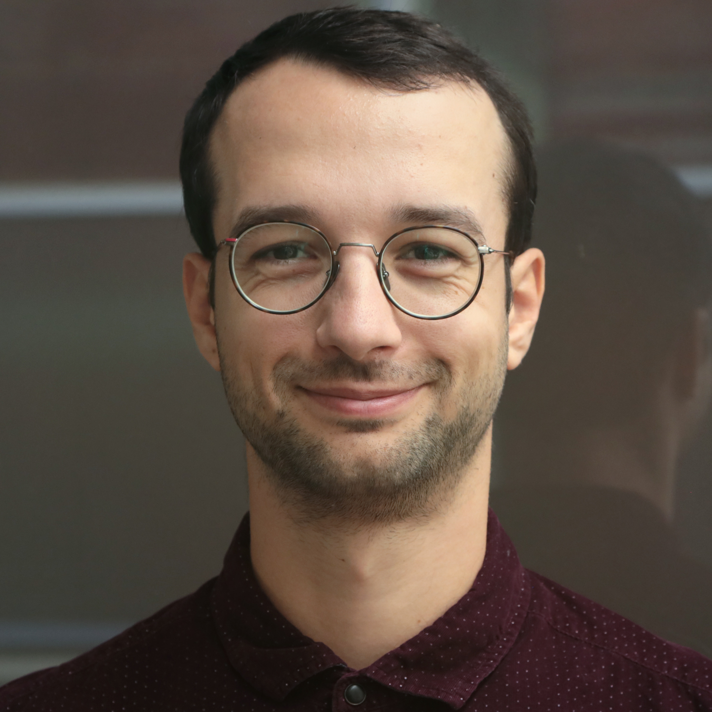{height="150px"}
:::

---

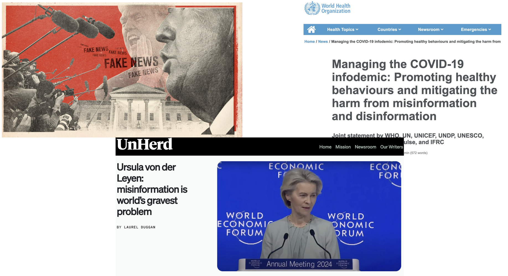{width="100%"}

:::{.notes}
Policiy makers generally worry about people believing misinformation
:::

---

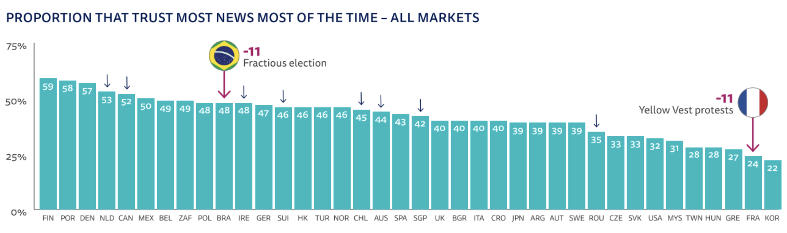{fig-align="center" width="100%"}

:::{.notes}
Something that is sometimes overseen: people don't seem to trust true information a whole lot
:::

---

## {.big-center}

There has been a lot of research on people's belief in misinformation

---

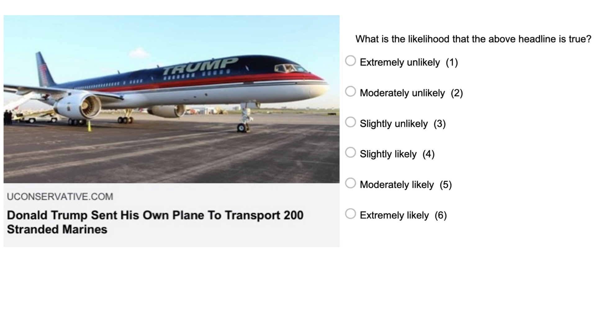{fig-align="center" width="100%"}

---

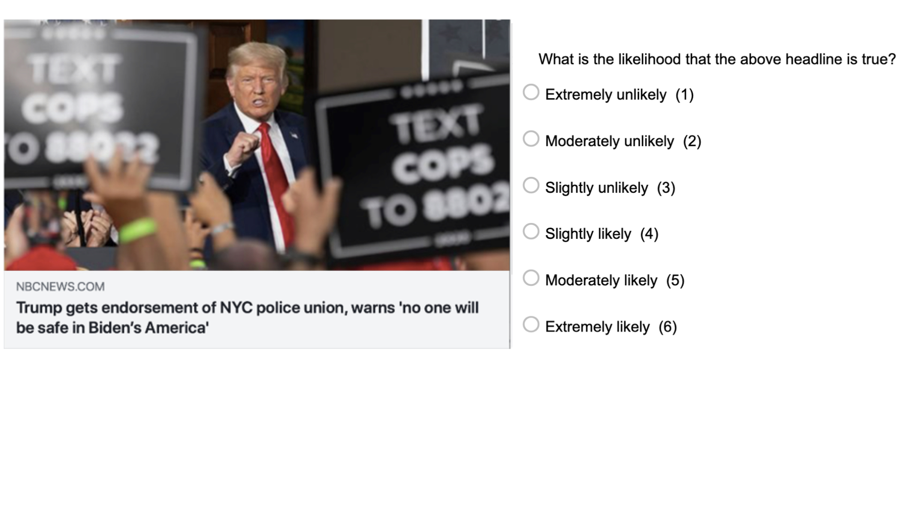{width="100%"}

---

::: {.big-center}
A meta-analysis

67 papers

194'438 participants

303 effect sizes 

40 countries
:::

---

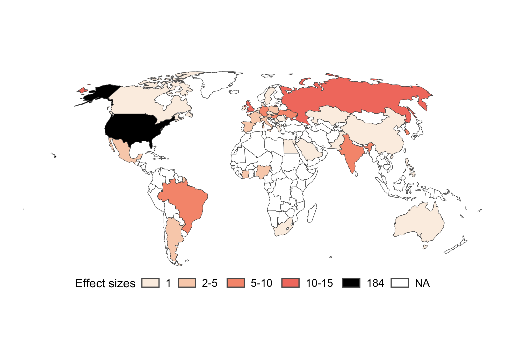

---

## {.big-center}

Discernment = Accuracy(true news) − Accuracy(false news)

---

::: {.big-center}
For 298 of the 303 effect sizes, people rated true news as (a lot) more accurate than false news
:::

---

{width="100%" style="background:white;" fig-align="center"}

---

## {.big-center}

On the whole, people did well in discerning true from false news…

. . .

but of course they still made some errors.

---

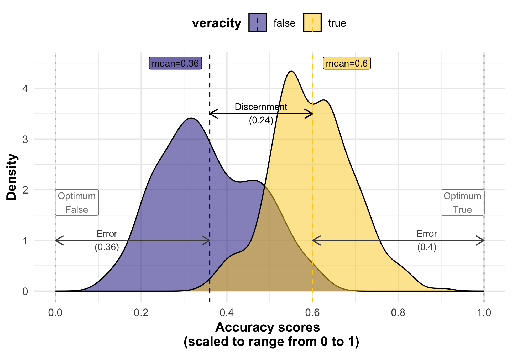{width="100%"}

---

## {.big-center}

Skepticism bias = Error(true news) - Error(false news)

---

::: {.big-center}
For 203 of 303 effect sizes, people made (slightly) more errors on true news than on false news. 
:::

---

{width="100%" style="background:white;" fig-align="center" }

---

## Interim conclusion 

::: {.big-center}

::: {.fragment}
People discern rather well between true and false news.
:::

::: {.fragment}
If they err, they tend to be more skeptical of true news than gullible towards false news.
:::

:::

---

## {.big-center}

But...

---

## {.big-center}

The vast majority of the studies relied on a hand full of fact-checked items (Snopes, PolitiFact etc.) selected by the researchers.

. . .

Only in 3 papers, the researchers automatically scraped news...

---

{width="70%"}

---

## Why is this interesting? 

::: {.big-center}

::: {.fragment}
We might not worry enough about people not believing true information.
:::

::: {.fragment}
Researchers should diversify their samples of news items
:::

:::

# Discussion

---

## {.big-center}

Most people trust science at least to some extent.

. . .

Yet, they don’t understand or know much about science.

---

## {.big-center}

The rational impression account:

. . .

When exposed to science (mostly during education) people rationally develop a positive impression of science–in particular of the competence of scientists by

. . .

- inferring competence from possessing rare knowledge

. . .

- inferring accuracy from consensus

. . .

However, they forget most of the information that gave rise to this impression.

---

## {.big-center}

This aligns with normative accounts, which suggest that science is trustworthy because of convergent results from multiple sources and methods <span style="font-size: 50%;">[@cartwrightTangleScienceReliability2022; @oreskesWhyTrustScience2019]</span>

# Limitations

---

## {.big-center}

The rational impression account explains trust--*not distrust*

. . .

Even people who trust most scientific knowledge can still distrust science on specific instances for many reasons

---

## {.big-center}

For example, because some knowledge is perceived as particularly inconvenient (e.g., knowledge of climate change which would urge us to change our behavior)

. . .

Or because it is rejected by other authorities–political, religious–people trust (e.g., the rejection of evolution among many religious communities).

---

## {.big-center}

Just because there is a rational explanation for trust, distrust does not need to be irrational.

. . .

Some groups have been systematically neglected or ill-treated by science, e.g. African Americans <span style="font-size: 50%;">[@brandtRacismResearchCase1978; @scharffMoreTuskegeeUnderstanding2010]</span> 

. . .

Even if people believe scientists are competent, people might believe that they don't have their best interest at heart. 

. . .

E.g., people who feel a general alienation from institutions (e.g. due to rising inequality) <span style="font-size: 50%;">[@gauchatCulturalAuthorityScience2011]</span> 

::: {.notes}
the tragically famous Tuskegee syphilis study 
:::

---

## {.big-center}

The rational impression account is only a micro-level explanation.

. . .

It should be seen as complementary with macro-level (historical, sociological or political) explanations of trust in science.

. . .

E.g., the political forces that led to the development of universal science education in many countries <span style="font-size: 50%;">[@childsCurriculumDevelopmentScience2015]</span>


# Implications

---

## {.big-center}

Science communication should not stress consensus and impressiveness at all costs

. . .

Transparency about uncertainty is crucial for a lasting trust relationship between science and the public <span style="font-size: 50%;">[@druckmanCommunicatingPolicyRelevantScience2015; @petersenTransparentCommunicationNegative2021]</span>

. . .

Intellectual humility has been shown to increase trust in scientists <span style="font-size: 50%;">[@koetkeEffectSeeingScientists2024]</span>

---

## {.big-center}

Ultimately, doing better science will foster trust in science

. . .

People value open-science practices <span style="font-size: 50%;">[@songTrustingShouldersOpen2022]</span>

. . .

These practices will lead to more robust and consensual scientific findings

. . .

E.g., mandatory pre-registration for clinical trials <span style="font-size: 50%;">[@kaplanLikelihoodNullEffects2015]</span>

---

## Thank you!

---

## References


